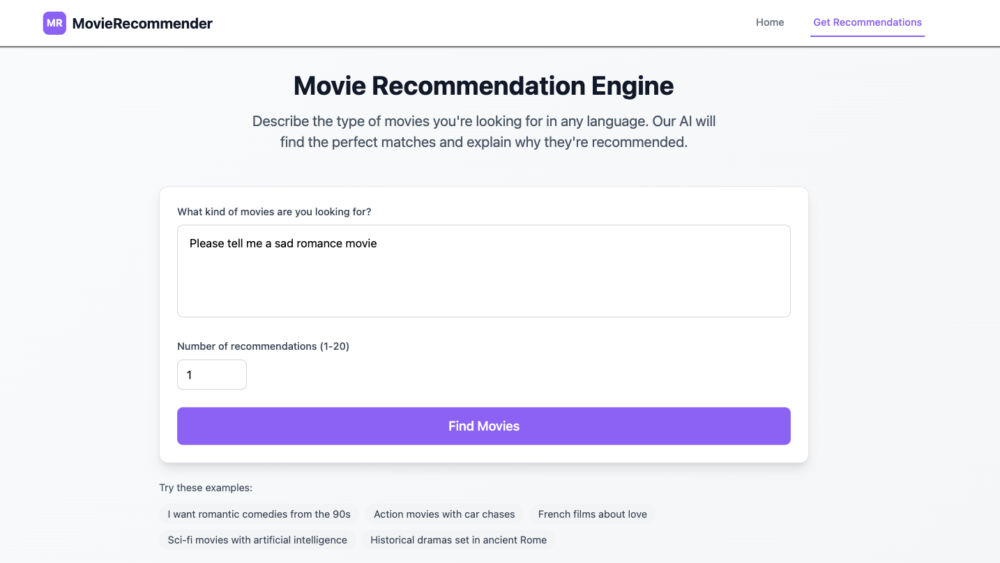
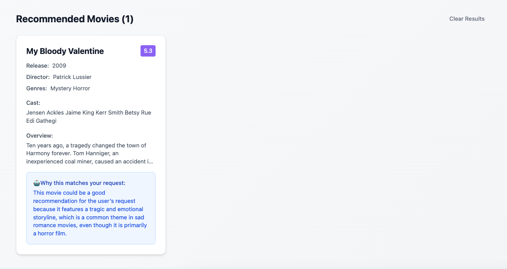

# 🎬 Movie Recommender Frontend

A **React + Vite** frontend for the Movie Recommender system, styled with **Tailwind CSS** and powered by a **FastAPI backend**. This application allows users to search for movies in **multiple languages**, get personalized recommendations, and see natural-language explanations generated by an LLM.

---

## 🚀 Features
- 🌐 Multi-language support (queries in any language).
- 🎨 Clean UI built with **Tailwind CSS**.
- ⚡ Fast development and build process using **Vite**.
- 🔗 Integration with the backend recommender API (FastAPI).
- 📱 Responsive design for desktop and mobile.

---

## 📷 Screenshots

> Add your screenshots to the `docs/screenshots/` folder and update the paths below.

### Landing Page


### Recommender Page


### Results


---

## 🛠️ Installation & Setup

### 1. Clone the repository
```bash
git clone https://github.com/n-mazaheri/recommender
cd recommender-frontend
```

### 2. Install dependencies
```bash
npm install
```


### 3. Run the development server
```bash
npm run dev
```
Open [http://localhost:5173](http://localhost:5173) in your browser.

### 4. Build for production
```bash
npm run build
```

### 7. Preview production build
```bash
npm run preview
```

---

## 🔗 Backend API
This frontend expects a running backend (FastAPI) recommender. 
Ensure your backend is deployed and accessible before using the frontend.
---

## 📦 Tech Stack
- [React](https://react.dev/) (Vite setup)
- [Tailwind CSS](https://tailwindcss.com/)
- [Axios](https://axios-http.com/)
- [FastAPI backend](https://fastapi.tiangolo.com/)

---

## 📝 License
MIT License

---

## 👨‍💻 Author
Developed by [Nasrin Mazaheri](https://github.com/n-mazaheri/recommender-frontend)


📞 Support
If you have any questions or issues, please open an issue on GitHub or contact me at [na.mazaheri@yahoo.com].

⭐ Star this repo if you found it helpful!
