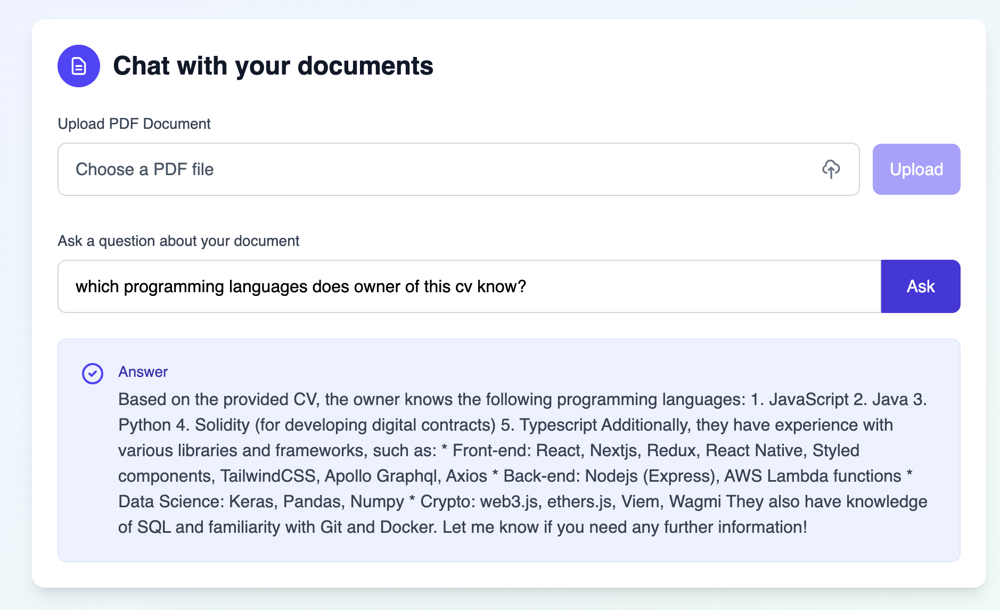

# ContextAI- Chat with Your Documents
A full-stack application that allows users to upload PDF documents and ask questions about their content using natural language. The application uses AI-powered responses based on the document's content.

## 🌟 Features
- User Authentication: Secure signup and login with JWT tokens

- PDF Upload: Easy drag-and-drop interface for uploading PDF documents

- AI-Powered Q&A: Ask questions about your documents in natural language

- Secure Storage: User-specific document embeddings stored in ChromaDB

- Modern UI: Clean, responsive interface built with Tailwind CSS

- Automatic Token Refresh: Seamless authentication experience

## 🛠️ Tech Stack
Frontend
- React - UI framework

- Tailwind CSS - Styling

- Axios - HTTP client with interceptors

- React Router - Navigation

- Vite


## 📦 Installation
- Prerequisites
  -Node.js (v18 or higher)

  -npm or yarn

- Clone the repository:

````
bash
git clone https://github.com/n-mazaheri/rag-frontend
cd rag-frontend
```` 
- Install dependencies:
```
bash
npm install
```

- Start the development server:

bash
```
npm run dev
```

## 🚀 Usage
- Sign Up/Login: Create an account or login to your existing account


- Upload PDF: Use the upload interface to add your PDF document

- Ask Questions: Type questions about your document's content

- Get Answers: Receive AI-generated responses based on your document




🔧 API Endpoints
- Authentication
  - POST /signup - Create a new user account

  - POST /signin - Authenticate user and receive tokens

  - POST /refresh - Refresh access token using refresh token

  - GET /protected - Verify authentication status

- Document Operations
  - POST /upload - Upload a PDF document

  - GET /ask - Ask questions about uploaded documents

## 🏗️ Project Structure

```
├── frontend/
│   ├── public/
│   ├── src/
│   │   ├── components/
│   │   │   ├── Auth.js
│   │   │   ├── Chat.js
│   │   │   ├── Landing.js
│   │   │   ├── ProtectedRoute.js
│   │   │   └── Favicon.js
│   │   ├── pages/
│   │   ├── api.js
│   │   └── App.js
│   ├── package.json
│   └── tailwind.config.js
└── README.md
```

## 🤝 Contributing
- Fork the repository

- Create a feature branch: git checkout -b feature/amazing-feature

- Commit your changes: git commit -m 'Add amazing feature'

- Push to the branch: git push origin feature/amazing-feature

- Open a pull request

## 📝 License
- This project is licensed under the MIT License - see the LICENSE file for details.

## 📞 Support
If you have any questions or issues, please open an issue on GitHub or contact me at [na.mazaheri@yahoo.com].

⭐ Star this repo if you found it helpful!